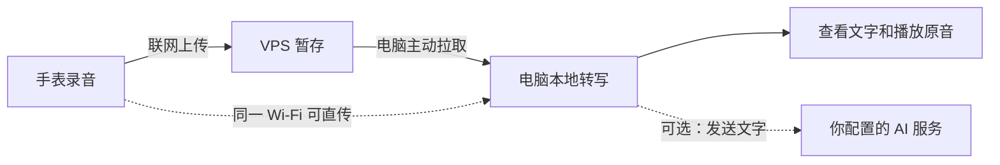

# WatchRec AI

在手表上录音，回到电脑上阅读文字、播放原音；需要时再用自己的 AI 服务整理全文和总结。

这是 **1.1.0 开源预览版**。服务器地址和连接密钥在软件界面里填写，不需要修改源码。没有公共服务器，也不会自动连接作者的设备。

## 先弄清楚三个端

| 程序 | 安装在哪里 | 做什么 |
| --- | --- | --- |
| 手表端 APK | 支持安装 Android 应用的手表 | 录音、播放，联网后上传 |
| 电脑端 | Windows 电脑；其他系统可从源码运行 | 拉取录音、本地语音转写、查看和导出结果 |
| VPS 服务 | 你自己的 Linux 服务器 | 暂存手表上传的音频，等电脑上线后取走处理 |

**没有单独的手机端。** APK 面向手表设计，普通 Android 手机可能能运行，但没有做全面兼容验证。Apple Watch 无法安装 Android APK。现有录音功能主要在 OPPO Watch 3 Pro 上使用过；本次预览版的兼容性与测试边界见 [验证记录](docs/validation.md)。

VPS 不负责语音转写，不需要显卡。电脑离线时录音暂存在 VPS；手表断网时先存在手表。电脑重新打开后继续同步。

## 你需要准备什么

- 一只能够安装 APK、带麦克风且能联网的 Android 手表。最低 Android 8.0 / API 26。
- 一台 Windows 10/11 64 位电脑。便携包使用 CPU 转写，长录音会较慢；源码方式可使用 NVIDIA 显卡。首次转写要联网下载模型，预留数 GB 磁盘空间。
- 若要离开家也能同步：一台 Linux VPS，以及能访问它的域名或 IP 加端口。推荐域名与 HTTPS。
- AI 总结可选。没有 API Key 仍然能录音、转写和播放。

**还没准备 VPS？** 可以先只用电脑端导入音频。也可以在电脑「连接与设置」中开启局域网直传，再在手表填写电脑地址；这种方式只在双方能互相访问的局域网中有效。

## 从哪里开始

打开 [1.1.0 预览版下载页](https://github.com/WWangZQ/WatchRecAI/releases/tag/v1.1.0-preview)，或直接点击下面的文件。第一次使用建议先看完本页，再按 VPS → 电脑 → 手表的顺序安装。GitHub 自动生成的 Source code 压缩包只有源码，不含可运行的安装包。

| 文件 | 用法 |
| --- | --- |
| [手表 APK](https://github.com/WWangZQ/WatchRecAI/releases/download/v1.1.0-preview/WatchRec-Watch-1.1.0-preview.apk) | 安装到手表；见 [手表安装](docs/watch.md) |
| [Windows 便携包](https://github.com/WWangZQ/WatchRecAI/releases/download/v1.1.0-preview/WatchRec-Windows-1.1.0-preview.zip) | 完整解压，双击其中的 `WatchRec.exe`；不要只拷走 EXE |
| [VPS 部署包](https://github.com/WWangZQ/WatchRecAI/releases/download/v1.1.0-preview/WatchRec-VPS-1.1.0-preview.zip) | 上传到 VPS，按 [VPS 部署](watchrec-vps/README.md) 执行命令 |
| [干净源码包](https://github.com/WWangZQ/WatchRecAI/releases/download/v1.1.0-preview/WatchRec-Source-1.1.0-preview.zip) | 源码与文档，供自行构建 |

下载校验值：[SHA256SUMS.txt](https://github.com/WWangZQ/WatchRecAI/releases/download/v1.1.0-preview/SHA256SUMS.txt)。此版本标记为 Pre-release（预览版）；已完成的测试及尚未覆盖的真机检查见 [验证记录](docs/validation.md)。

手表 APK 是已签名的调试预览包，便于侧载验证。电脑 EXE 未使用商业代码签名；系统可能提示未知发布者。后续正式发布需使用维护者持有的固定签名密钥。

### 第一步：把 VPS 准备好

按 [VPS 部署教程](watchrec-vps/README.md) 操作。教程区分 Linux 服务器命令和 Windows 电脑命令，不需要修改 Python 代码。

完成后，你应该得到两样东西：

1. **服务器地址**：例如 `https://rec.example.com`，或 `http://你的公网IP:8765`。
2. **连接密钥**：VPS `.env` 中的 `APP_TOKEN`。部署脚本会为你随机生成。

教程中的 `example.com`、示例 IP 和「你的…」都需要替换。IP 加端口同样支持 HTTPS，但证书必须对这个 IP 有效；自签名证书不能直接使用。

### 第二步：打开电脑端

1. 解压 Windows 便携包，双击 `WatchRec.exe`。不需要单独安装 Python、conda 或修改现有浏览器应用。
2. 首次窗口会显示「连接你的录音设备」。填写 VPS 地址和连接密钥，点击 **测试连接**。
3. 出现连接成功后点击 **保存设置**。等待当前任务完成，关闭并重新打开开源版，开始同步。
4. 之后随时从右上角 **连接与设置** 修改；AI API 配置在左下角 **设置 → AI 设置** 中。

电脑端仍是本地网页界面，启动器用 Chrome 或 Edge 打开独立窗口。仅安装网页快捷方式不会启动后台服务。详细运行方式、GPU 安装和排错见 [电脑端说明](docs/desktop.md)。

### 第三步：安装并连接手表

1. 按 [手表安装教程](docs/watch.md) 安装 APK，打开 **WatchRec 开源版**。
2. 点击主界面顶部 **连接设置**，填写与电脑相同的 VPS 地址和连接密钥。
3. 点击 **测试连接**，成功后 **保存并返回**。
4. 点录音按钮，允许麦克风权限，说十几秒话，再点一次停止录音。

先做这条短录音验收：手表列表出现上传成功标记 → 电脑中出现新录音 → 能播放原音并看到转写文字。连接测试成功只说明地址和密钥可用，还不能代替这一步。首次模型下载比后续转写慢，可打开电脑左下角的服务日志查看进度。

## 地址究竟怎么填

| 你的情况 | 软件中填写 |
| --- | --- |
| 域名，标准 HTTPS 端口 | `https://rec.example.com` |
| 域名，自定义端口 | `https://rec.example.com:8443` |
| IPv4 加端口 | `http://192.168.1.20:8765`（示例为内网地址） |
| 反向代理挂在子路径 | `https://example.com/watchrec`（代理须去掉此前缀后转发） |
| 手表直接传到家中电脑 | 在手表「电脑直传地址」填写 `http://电脑局域网IP:18765` |

不要填写 VPS 的 SSH 端口；SSH 通常只负责登录服务器。不要在地址后面加 `/upload` 或 `/health`。手表里的 `localhost` 指手表自己，不能用来指电脑。

**连接密钥不是 AI API Key。** `APP_TOKEN` 是你这套三端之间的通行密钥；AI API Key 只填电脑的 AI 设置，用于你选择的 AI 服务。HTTP 会明文传输录音和密钥；公网使用有效 HTTPS 证书。

## 录音和配置保存在哪里

- 手表：开源版自己的应用目录。默认不自动清理；在连接设置中可选择保留天数，只清理已上传且超期的录音。卸载会删除这个应用的本地数据。
- Windows 便携包：`%LOCALAPPDATA%\WatchRecOpenSource\`。其中 `downloads/` 是录音和转写，`connection.json` 是连接配置，`settings.json` 是 AI 配置，`models/` 是模型缓存。
- 电脑源码版：`watchrec-server/data/`。可用 `WATCHREC_HOME` 环境变量指定其他目录。
- VPS 原生部署：`watchrec-vps/data/uploads/`；Docker 使用命名卷。默认只清理已转写且上传超过 3 天的录音，待处理录音不自动删除；`RETENTION_DAYS=0` 可关闭自动清理。

VPS 是中转，不是长期备份。请备份电脑的数据目录。启用 AI 整理后，转写文字会发送给你配置的服务；未配置时只进行本地转写。

## 遇到问题

| 现象 | 先检查 |
| --- | --- |
| 测试显示 401 | 三端的连接密钥是否完全一致，VPS 改密钥后是否重启 |
| 连接超时 | VPS 服务、域名解析、云防火墙和系统防火墙、端口映射 |
| 证书校验失败 | HTTPS 地址与证书是否匹配，手表系统日期是否正确 |
| 返回的不是 WatchRec 服务 | 填成了网页首页或另一端地址；检查反向代理和部署版本 |
| 电脑没有新录音 | 保存连接后是否重启；手表是否已上传；等待一轮约 30 秒的同步 |
| 能看到录音但转写失败 | 查看电脑服务日志，检查模型下载、磁盘空间和转写设备 |
| 端口被占用 | 开源版不会复用该端口上的未知服务；按错误提示修改开源版自己的 `connection.json` |

更多内容：[手表](docs/watch.md) · [电脑](docs/desktop.md) · [VPS](watchrec-vps/README.md) · [自行构建](docs/build.md) · [本次验证](docs/validation.md)
